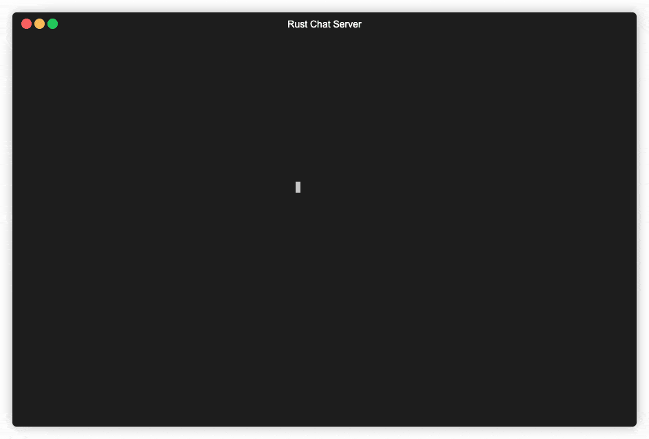
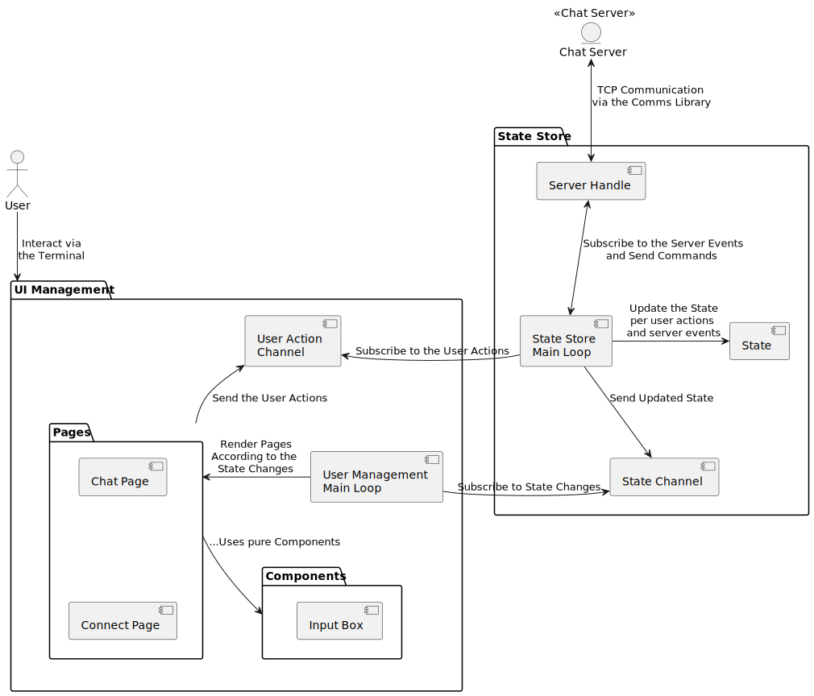

# Positivity Exchange

This project serves as a way for effective communication among like minded individuals built using [Rust](https://www.rust-lang.org/), [Tokio](https://tokio.rs/), [Channels](https://tokio.rs/tokio/tutorial/channels), and TUI (Terminal User Interface) programming. It features a room-based chat server with a Terminal User Interface (TUI), utilizing technologies such as Tokio, Ratatui, and a Redux-inspired architecture.




## Setup Instructions

To get the project up and running, follow these steps:

1. Clone the repository: `git clone https://github.com/dhruvmehtaaa/Positivity-Exchange.git`
2. Make sure you have [Rust and Cargo](https://www.rust-lang.org/tools/install) installed.
3. Change to the project directory: `cd Positivity-Exchange`
4. Start the server: `cargo run --bin server`
5. Launch one or more TUI instances: `cargo run --bin tui`

## Project Overview

The project utilizes Rust Workspaces to divide itself into three sub-projects, each sub-project is explained in detail with the concepts and architecture. Below is a brief overview:

- [comms](./comms/): This sub-project houses a library crate that provides Events and Commands used for server-client communication. It also offers client/server socket utilities, enabled via feature flags, to assist in serializing and deserializing events and commands.
- [server](./server/): Built on the [Tokio Runtime](https://tokio.rs/) and using [Tokio Channels](https://tokio.rs/tokio/tutorial/channels), this sub-project implements a single-instance chat server that manages room states and user participation.
- [tui](./tui/): Leveraging [Ratatui](https://github.com/ratatui-org/ratatui), this sub-project implements a terminal-based user interface. Users can connect to a chat server, join rooms, and send/receive messages. The code follows a Redux-inspired structure to separate state management from TUI rendering.

# Comms Library

The `comms` library, short for "communications," serves as an auxiliary module for the Positivity Exchange project. It provides definitions and utilities for handling events and commands.

## Features

- Definitions and documentation for [events](./comms/src/event.rs) and [commands](./comms/src/command.rs) utilized by the server.
- TCP transport support for both **events** and **commands**.
  - [`comms::transport::client`](./comms/src/transport/client.rs) assists in splitting a [tokio::net::TcpStream](https://docs.rs/tokio/latest/tokio/net/struct.TcpStream.html) into an **EventStream** and a **CommandWriter**.
  - [`comms::transport::server`](./comms/src/transport/server.rs) enables the partitioning of a [tokio::net::TcpStream](https://docs.rs/tokio/latest/tokio/net/struct.TcpStream.html) into a **CommandStream** and an **EventWriter**.

## Example Usage

Execute the e2e test for client and server with the following command: `cargo test --features="client,server"`

[This e2e test](./comms/tests/e2e_server_and_client_transport.rs) spawns a server and a client. The server accepts one client, sends it an event, and listens for commands until the connection is closed. Conversely, the client receives one event, sends two commands, and then terminates its connection.

Here's a simplified pseudocode version of the [e2e test code](./comms/tests/e2e_server_and_client_transport.rs):

```rust
// full e2e test code: comms/tests/e2e_server_and_client_transport.rs

#[tokio::main]
async fn main() -> anyhow::Result<()> {
    tokio::try_join!(server_example(), client_example())?;
    // All examples succeed if this line is reached.
    Ok(())
}

async fn server_example() -> anyhow::Result<()> {
    let listener = /* Create a TcpListener */;
    let tcp_stream = /* Accept a single client from `listener` */;
    // Use comms::transport to elevate the TcpStream to a higher-level API.
    let (mut command_stream, mut event_writer) = transport::server::split_tcp_stream(tcp_stream);

    event_writer.write(/* Login Successful Event */).await?;

    // Loop to read and print commands until the client closes the connection.
    while let Some(result) = command_stream.next().await {
        match result {
            Ok(command) => println!("SERVER: Command received: {:?}", command),
            Err(e) => println!("SERVER: Failed to read command: {}", e),
        }
    }

    Ok(())
}

async fn client_example() -> anyhow::Result<()> {
    let tcp_stream = /* Connect to the server */;
    // Use comms::transport to elevate the TcpStream to a higher-level API.
    let (mut event_stream, mut command_writer) = transport::client::split_tcp_stream(tcp_stream);

    // Read and print a single event.
    match event_stream.next().await {
        Some(Ok(event)) => println!("CLIENT: Event received: {:?}", event),
        Some(Err(e)) => println!("CLIENT: Failed to read event: {}", e),
        None => return Err(anyhow::anyhow!("Server closed the connection")),
    }

    command_writer.write(/* Join Room Command */).await?;
    command_writer.write(/* Send Message Command */).await?;

    Ok(())
}
```

# Positivity Exchange - Server Binary

The `server` binary is the backbone of the server. It establishes a TCP server, listening for events and commands through our [comms library](/comms).

---

## 🛠 Technical Overview

- **Async I/O**: Utilizes [Tokio Runtime](https://tokio.rs/) and [Tokio Streams](https://tokio.rs/tokio/tutorial/streams) for asynchronous, non-blocking I/O.
- **Actor-like Model**: Uses [Tokio Channels](https://tokio.rs/tokio/tutorial/channels) for an actor-inspired, lightweight architecture.
- **Chat Rooms**: File-based (JSON) chat room definitions in the [resources/](./resources/chat_rooms_metadatas.json) folder.

## 🏗 High-Level Architecture 


1. **Bootstrap**: Reads from [resources/](./resources/chat_rooms_metadatas.json) to initialize chat rooms.
2. **Server Start**: Handles a variable number of concurrent users. For a terminal-based client, see the [tui project](/tui/).
    - **Commands**: Join, leave rooms or send room-specific messages.
3. **ChatSession**: Manages individual user commands and room subscriptions.
    - Joins rooms via interaction with `RoomManager`, receiving a `broadcast::Receiver<Event>` and a `UserSessionHandle`.
    - On room exit, `UserSessionHandle` is returned to `RoomManager`.
4. **Messaging**: Maintains an in-memory list of `UserSessionHandle`s for room messaging.
    - Tasks are created to unify messages from different rooms into a single `mpsc::Receiver<Event>`.
5. **User Output**: Unified events are sent to the user through the TCP socket.

## 🚀 Getting Started

Run the server with `cargo run` or `cargo run --bin server` according to your working directory. Defaults to port `:8080`. Any bootstrap issues will result in an application exiting with error.

## 🧪 Stress Testing

- **Example**: Check [stress_test](./server/tests/stress_test.rs) in the examples directory.
- 🚨 **Socket Limits**: Ensure both server and stress test socket limits are configured for high user volumes.
  
Run the stress test with `cargo run --example stress_test`.

### 📈 Stress Test Outcomes

> 🚫 No rigorous load testing was conducted, but several preliminary tests were done.

## 📈 Scaling Further

The server is currently optimized for vertical scaling by making full use of multiple cores. However, it can only scale so far within a single instance, bound by the hardware or code optimization limits.

To truly scale horizontally, several strategies can be employed:

1. **Sharding Rooms**: Distribute chat rooms among multiple server instances, directing users to the correct instance based on their room selection.
2. **Fan-Out Queue**: Incorporate a fan-out message queue architecture where each server instance consumes and broadcasts messages to its connected users.

Your choice will depend on specific requirements:

- **Limited Users, Multiple Rooms**: Option #1 is ideal for a Discord-like architecture with multiple rooms but limited users per server (e.g., up to 1,000).
- **Global Rooms, High Concurrency**: For a setup where room lists are global and user counts are high, option #2 offers better scalability.
- **High Volume, Hybrid Approach**: If you expect both high user counts and multiple servers, a hybrid approach of options #1 and #2 would provide the greatest scalability.

# 🎮 Positivity Exchange - TUI Client

The `tui` binary provides a terminal-based UI for the chat server. This interface communicates with the server using a TCP client via our [comms library](/comms).


---

## 🛠 Technical Stack

- **Async I/O**: Leverages [Tokio](https://tokio.rs/) for asynchronous tasks and non-blocking I/O, integrating both [Tokio Streams](https://tokio.rs/tokio/tutorial/streams) and [Crossterm's EventStream](https://docs.rs/crossterm/latest/crossterm/event/struct.EventStream.html).
- **Flux-inspired Design**: Implements a simplified [Flux Architecture](https://facebookarchive.github.io/flux/docs/in-depth-overview) to decouple UI and user/server interactions, facilitated by [Tokio Channels](https://tokio.rs/tokio/tutorial/channels).
- **TUI Rendering**: Utilizes [ratatui-org/ratatui](https://github.com/ratatui-org/ratatui) for terminal-based UI rendering.

## 🏗 Architectural Overview 



1. **State Store & UI Management Loop**: On startup, the application initializes loops for both **State Store** and **UI Management**, and sets up channels for **State Updates** and **User Actions**.
2. **UI Management**: 
   - **Pages** and **Components** sub-modules separate UI-related logic, resembling the structural design in modern web SPAs.
   - State-linked components can emit **User Actions** like server connection requests, room joins, and message sends.
   - A dedicated loop orchestrates the UI updates based on both state changes and terminal events.
3. **State Store**: 
   - **State Store** subscribes to **User Actions** to manage server connections and commands.
   - Upon processing **User Actions** or **Server Events**, **State Store** pushes the new state to the **State Channel** for UI updates.

## 🚀 Quick Start

Run the TUI client using `cargo run` or `cargo run --bin tui`. Upon bootstrap, you will be asked to enter a server address. The server address field will default to `localhost:8080`. Press `<Enter>` after entering the server you want to connect to.

Server disconnections will trigger a state reset, requiring re-login.


## License

The project is distributed under the [MIT License](./LICENSE).
